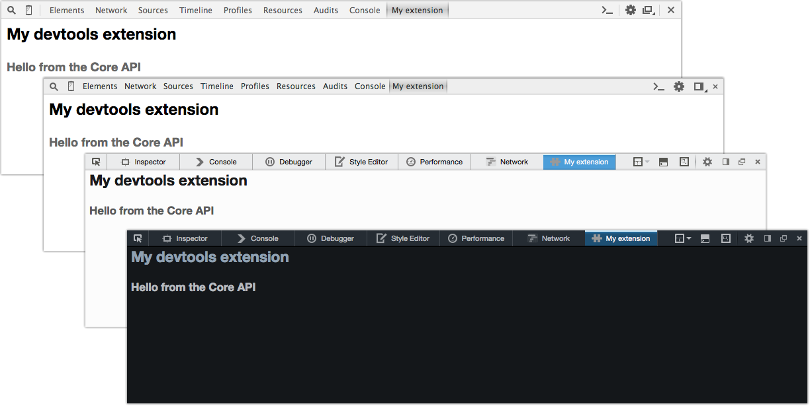

# Fuse: devtools

A boilerplate for creating a devtools extension for multiple browsers from a single code base.



Currently Fuse will build bare-bones devtools extensions for:

* Firefox (restartless)
* Chrome
* Opera

## Getting started

Fuse requires Node.js and npm so you'll need to make sure you have them installed before going any further.

```
npm install
```

## Configure the extensions

* `config/firefox.json`
  * give your extension a unique ID (email address syntax)


## Building the extensions

The quickest way to get started is to run the build task. This will lint, test and build the extensions ready for installation.

```
grunt build
```

If you want to build individual extensions you can run:

```
grunt core
grunt core chrome
grunt core firefox
grunt core opera
```

### Linting files
Linting is done with JSHint. To lint all project files, use the `lint` alias task:
```
grunt lint
```

### Running tests
Fuse uses Jasmine for tests. To run all project tests, use the `test` alias task:
```
grunt test
```

## Installing the extensions

First, make sure you've built the extension you want to install then follow the instructions below.

### Chrome
Browse to chrome://extensions, tick the '**Developer mode**' option, click '**Load unpacked extension**' and select the `build/chrome` directory. If all goes well, when you open/restart devtools you should see your extension tab in the devtools pane.

### Opera
Browse to opera://extensions, tick the '**Developer mode**' option, click '**Load unpacked extension**' and select the `build/opera` directory. If all goes well, when you open/restart devtools you should see your extension tab in the devtools pane.

### Firefox
Firefox requires extensions to be signed before they can be enabled in the Add-on manager. During development you will need to disable add-on signing for you add-on to work. You can do this by visiting `about:config` and settting `xpinstall.signatures.required` to `false`.

Once add-on signing is disabled, browse to your Firefox profile and find the `extensions` directory:

* OSX: `/Users/[Username]/Library/Application Support/Firefox/Profiles/[profileID]/extensions`
* Win: `C:\Users\[Username]\AppData\Roaming\Mozilla\Firefox\Profiles\[profileID]\extensions`

In this directory create a new text file with a name that matches the extension ID (the value in `config/firefox.json`). Open this new file in a text editor and paste the path to the Firefox build directory. Now (re)start Firefox and your extension tab should appear in the devtools pane.


## Developing your extension

Fuse uses a grunt watch task to monitor your source files so they can be tested and rebuilt as you make changes. Once you've made your changes you'll need to restart devtools to see your changes.

```
grunt build watch
```

_Note: If you modify the core or extension source without running the watch task you'll need to manually build the extension._


### Which files should I work with?

The main body of work for your extension will be done in the following files:

Markup:

* Firefox: `src/firefox/chrome/panel.xul`
* Chrome / Opera: `src/chromium/panel.html` 

JavaScript:

* Core API `src/core/core.js` 
* Firefox: `src/firefox/chrome/js/main.js`
* Chrome / Opera: `src/chromium/js/main.js` 

CSS:

* Firefox: `src/firefox/skin/css/main.css`
* Chrome / Opera: `src/chromium/css/main.css` 


## Packaging your extension

Fuse can package your extension into a standalone installable files. To package everything, ensure your have run the relevant build tasks and then run:

```
grunt package
```

If you need to package individual extensions:

```
grunt package:chrome
grunt package:opera
grunt package:firefox
```


## Project structure

### /config
Your browser specific configuration files go here.


### /assets
The assets directory contains the assets that will be shared across all extensions. Typically, this is where you'll store you various icons and common UI elements. During build these files are copied into each extensions relevant `img` directory.

Since these assets don't physcially exist in the `src/{extension}` directories so you need to reference them using their build location. If you wanted to reference the icon at `/assets/img/icon-128.png` you would use the following paths (which are relative to `/build/{browser_extension}`):

* In Chrome `img/icon-128.png`
* In Opera `img/icon-128.png`
* In Firefox `skin/img/icon-128.png`


### /lang
This is where your localisation files live. Extensions are developed in English with the base messages defined in `/lang/en.json`. When a build task is run, the `.json` files in the `/lang` directory are used to create the various localisation files.

In `lang/en.json`:
```
{
  greeting: "Hello"
}
```

In `lang/fr.json`:
```
{
  greeting: "Bonjour"
}
```

These strings are accessed with the browsers built-in localisation helpers:

For Chromium:
```js
var message = chrome.i18n.getMessage('greeting');
```

For Firefox: 
```js
var message = L10N.getStr('greeting');
```


### /src/core
CoreAPI is the backbone of your extension. It should be self-contained and not use browser specific code. During build the core files are copied into each browser extensions build directory:

* For Chrome: `js/core.js`
* For Opera: `js/core.js`
* For Firefox: `chrome/js/core.js`


### /src/chromium
The chromium directory contains all the files required to create the extensions for Google Chrome and Opera. During build the following dependencies are merged into the directory:

For Chrome:
* `/assets/img/*` => `/chrome/img/*`
* `/build/core/core.js` => `/chrome/js/core.js`
* `lang/*.json` => `/chrome/_locales/*/messages.json` (formatting changes)
 
For Opera:
* `/assets/img/*` => `/opera/img/*`
* `/build/core/core.js` => `/opera/js/core.js`
* `lang/*.json` => `/opera/_locales/*/messages.json` (formatting changes)


### /src/firefox
The firefox directory contains all the files required to create the Firefox extension. During build the following dependencies are merged into the directory:

* `/assets/img/*` => `/firefox/skin/img/*`
* `/build/core/core.js` => `/firefox/chrome/js/core.js`
* `lang/*.json` => `/locale/*/strings.properties` (formatting changes)


### /tests
This is where your unit tests live.
